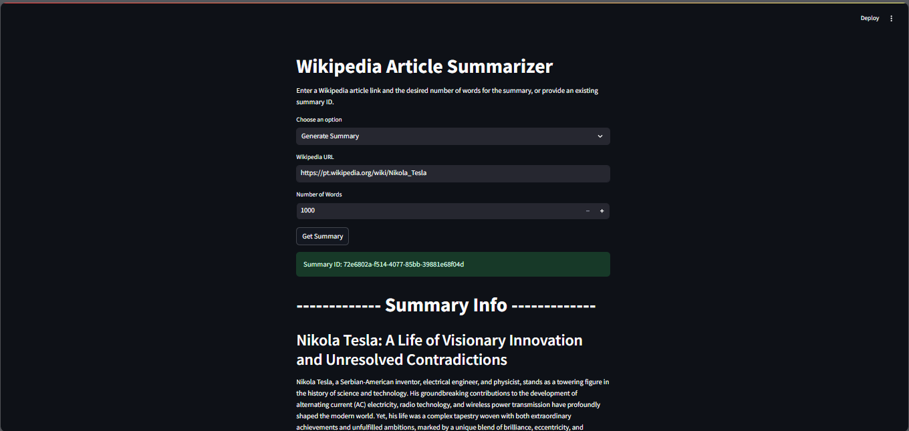

# Wikipedia Summarizer API

## Overview

The **Wikipedia Summarizer API** is a FastAPI-based application that allows users to generate summaries of Wikipedia articles. The application supports both synchronous and asynchronous database operations and leverages advanced language models to produce concise summaries.

## Features

- **Insert Wikipedia Articles**: Submit a Wikipedia URL to generate and store a summary.
- **Retrieve Summaries**: Fetch the summary of a Wikipedia article using a unique identifier.
- **Asynchronous Operations**: Efficient handling of database operations using asynchronous programming.
- **Language Model Integration**: Utilizes advanced language models for generating high-quality summaries.

## Table of Contents

- Installation
- Usage
- API Endpoints
- Project Structure
- Configuration
- Running Tests
- Contributing
- License

## Installation

1. **Clone the repository**:
    ```sh
    git clone https://github.com/yourusername/wikipedia-summarizer-api.git
    cd wikipedia-summarizer-api
    ```

2. **Create and activate a virtual environment**:
    ```sh
    python -m venv venv
    source venv/bin/activate  # On Windows use `venv\Scripts\activate`
    ```

3. **Install the dependencies**:
    ```sh
    pip install -r requirements.txt
    ```

4. **Set up environment variables**:
    Create a `.env` file in the root directory and add the following:
    ```env
    POSTGRES_DB_URL=your_postgres_db_url
    GOOGLE_API_KEY=your_google_api_key
    FASTAPI_URL=http://your_host:your_port/summarizer
    ```

## Usage

1. **Run the FastAPI application**:
    ```sh
    uvicorn app.main:app --reload
    ```

2. **Access the API documentation**:
    Open your browser and navigate to `http://127.0.0.1:8000/docs` to view the interactive API documentation.

## API Endpoints

### Insert Article

- **Endpoint**: `/summarizer/insert_article`
- **Method**: `POST`
- **Description**: Inserts a Wikipedia article and generates a summary.
- **Request Body**:
    ```json
    {
        "wikipedia_url": "https://en.wikipedia.org/wiki/Nikola_Tesla",
        "number_of_words": 1000
    }
    ```
- **Response**:
    ```json
    {
        "id": "unique-identifier",
        "info": "Data inserted successfully",
        "warning": "You configured the number of words below 1000, the lowest value of this parameter is 1000."
    }
    ```

### Get Summary

- **Endpoint**: `/summarizer/get_summary/{uuid}`
- **Method**: `GET`
- **Description**: Retrieves the summary of a Wikipedia article using a unique identifier.
- **Response**:
    ```json
    {
        "uuid": "unique-identifier",
        "summary": "The summary text of the Wikipedia article."
    }
    ```

## Project Structure
```
summarizer/
│
├── .vscode/
│   └── launch.json
├── backend/
│   ├── routes/
│   ├── app/
│   │   ├── api/
│   │   │   ├── routes/
│   │   │   │   ├── init.py
│   │   │   │   └── summarizer.py
│   │   │   ├── init.py
│   │   │   └── main.py
│   │   ├── build/
│   │   │   ├── chains/
│   │   │   │   ├── init.py
│   │   │   │   ├── map.py
│   │   │   │   └── reduce.py
│   │   │   ├── graphs/
│   │   │   │   ├── init.py
│   │   │   │   ├── edges.py
│   │   │   │   ├── nodes.py
│   │   │   │   ├── states.py
│   │   │   │   └── workflow.py
│   │   │   ├── init.py
│   │   │   ├── loader.py
│   │   │   └── models.py
│   │   ├── tests/
│   │   │   ├── init.py
│   │   │   ├── test_routes.py
│   │   │   └── test_utils.py
│   │   ├── utils/
│   │   │   ├── init.py
│   │   │   ├── async_db_connection.py
│   │   │   ├── config.py
│   │   │   ├── functions.py
│   │   │   └── sync_db_connection.py
│   │   ├── init.py
│   │   └── main.py
│   ├── db/
│   │   ├── docker-compose.yaml
│   │   ├── Dockerfile
│   │   └── init.sql
│   ├── Dockerfile
│   ├── poetry.lock
│   └── pyproject.toml
├── docs/
├── frontend/
│   ├── init.py
│   ├── Dockerfile
│   ├── poetry.lock
│   ├── pyproject.toml
│   └── streamlit_app.py
├── .env
├── .gitignore
├── docker-compose.yaml
├── requirements.txt
└── README.md
```

## Configuration

- **POSTGRES_DB_URL**: The URL for your PostgreSQL database.
  - Expected entry is something like: 
    - `://user:password@host:port/wiki_summarizer`
- **GOOGLE_API_KEY**: The API key for accessing Google services.
- **FASTAPI_URL**: The URL that will be available the backend FastAPI.
  - Suggestion is to use: `http://localhost:8000/summarizer`

## AI Agent Architecture

This section dives into the heart of the application's backend, exploring the LangGraph framework used to orchestrate the summarization process.

LangGraph provides a powerful framework for building stateful, multi-step applications. In our case, it allows us to define a series of steps involved in generating a concise summary of a Wikipedia article.

**Building the Workflow with State and Nodes**
- **State**:  We define a state object named OverallState that likely holds information about the current processing stage and potentially intermediate results.

- **Nodes**: Each step in the summarization process is represented as a node within the LangGraph workflow. The code snippet showcases several key nodes:

  - **generate_summary**: This node initiates the summarization process, potentially using a pre-trained language model to generate a preliminary summary.
  - **collect_summaries**: This node might be responsible for gathering additional summaries or information from various sources.
  - **collapse_summaries** (conditional): This node conditionally merges or condenses the gathered summaries, potentially based on certain criteria.
  - **generate_final_summary**: This node takes the processed summaries and generates the final, human-readable summary of the Wikipedia article.

- **Edges**:  Edges connect these nodes, defining the order of execution and data flow between them.

The workflow starts at the START node and conditionally branches to different nodes based on logic defined in functions like map_summaries and should_collapse.

Edges between other nodes ensure the proper sequence of operations, such as generating a summary before collecting them.

The final node generate_final_summary leads to the END state, signifying the completion of the summarization process.
Compiling the Graph

Finally, the compile() method on the StateGraph object transforms the defined nodes, edges, and state into a structured LangGraph workflow, ready to be executed and generate summaries for your chosen Wikipedia articles.

**Benefits of LangGraph**:

- Clear Visualization: The graph structure provides a clear and visual representation of the summarization process, making it easier to understand and maintain the application logic.
- Modular Design: By separating concerns into individual nodes, the code becomes more modular and reusable.
- Conditional Execution: LangGraph allows for conditional branching based on defined states, enabling more flexible and adaptable summarization workflows.

## Building and Running with Docker and Docker Compose

This project leverages Docker and Docker Compose for streamlined development and deployment. This section guides you through building container images from the individual Dockerfiles located within the project and running the application using Docker Compose.

Prerequisites
- **Docker**: Ensure you have Docker installed on your system. Download and install it from the official website: https://www.docker.com/
- **Docker Compose**: Follow the instructions on the official website to install Docker Compose: https://docs.docker.com/compose/

**Building Docker Images from Individual Dockerfiles**

- Backend Image:
  - Navigate to the backend directory: `cd backend`
  - Build the image: `docker build -t summarizer:backend`
- Frontend Image (if applicable):

  - Navigate to the frontend directory: `cd frontend`
  - Build the image: `docker build -t summarizer:frontend`

Replace <image_name> and <tag> with your desired names and versions.

**Running the API with Docker Compose**

- Navigate to the project root directory: `cd <project_root>`
- Run Docker Compose: `docker-compose up -d`

This command uses the `docker-compose.yaml` file to start the containers for both the backend and frontend services.

**Stopping and Removing Containers**

- Stopping containers: `docker-compose stop`
- Removing stopped containers and volumes: `docker-compose down`

Note: This removes any data stored within the container volumes. Use this command with caution, especially if you have made any modifications you want to keep.

**Building Images from Individual Dockerfiles**

While docker-compose build is convenient, you can also build images from the individual Dockerfiles located within the project. Navigate to the directory containing the desired Dockerfile (e.g., root directory) and run:

```
docker build -t <image_name>:<tag>
```

Replace <image_name> with a desired name and <tag> with an optional version identifier (defaults to latest).

For example, to build the backend image named `summarizer:backend`:

```
docker build -t summarizer:backend
```

This approach offers more flexibility for building specific images.

This section provides a foundation for using Docker and Docker Compose with this project. The `docker-compose.yaml` file itself might offer additional configurations or environment variables specific to this application. It's recommended to review that file for any further customization options.

## Application Preview



## Running Tests

1. **Install test dependencies**:
    ```sh
    pip install pytest httpx
    ```

2. **Run the tests**:
    ```sh
    pytest
    ```

## Contributing

Contributions are welcome! Please follow these steps:

1. Fork the repository.
2. Create a new branch (`git checkout -b feature-branch`).
3. Make your changes.
4. Commit your changes (`git commit -m 'Add new feature'`).
5. Push to the branch (`git push origin feature-branch`).
6. Open a Pull Request.

## License

This project is licensed under the MIT License. See the LICENSE file for details.

